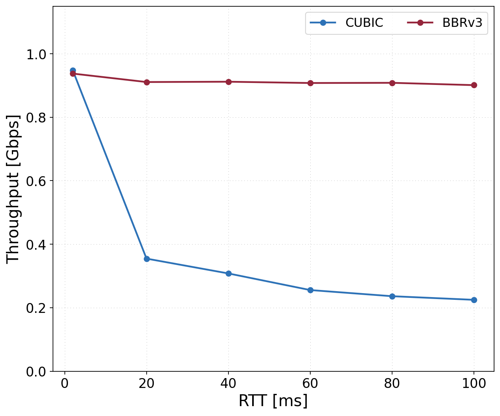
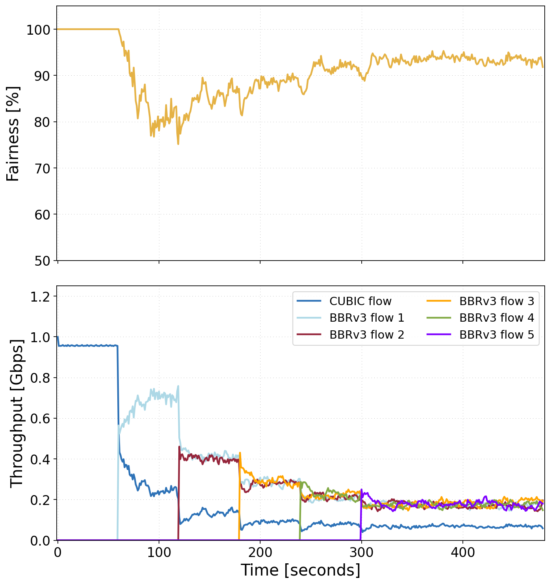
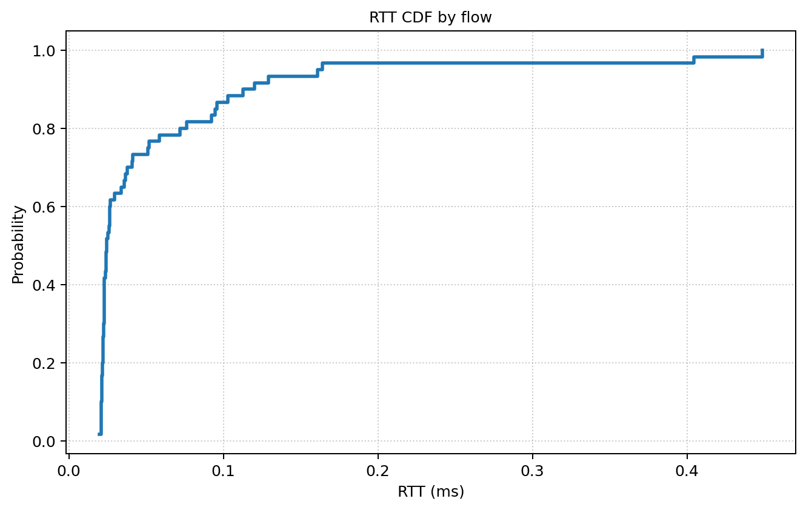
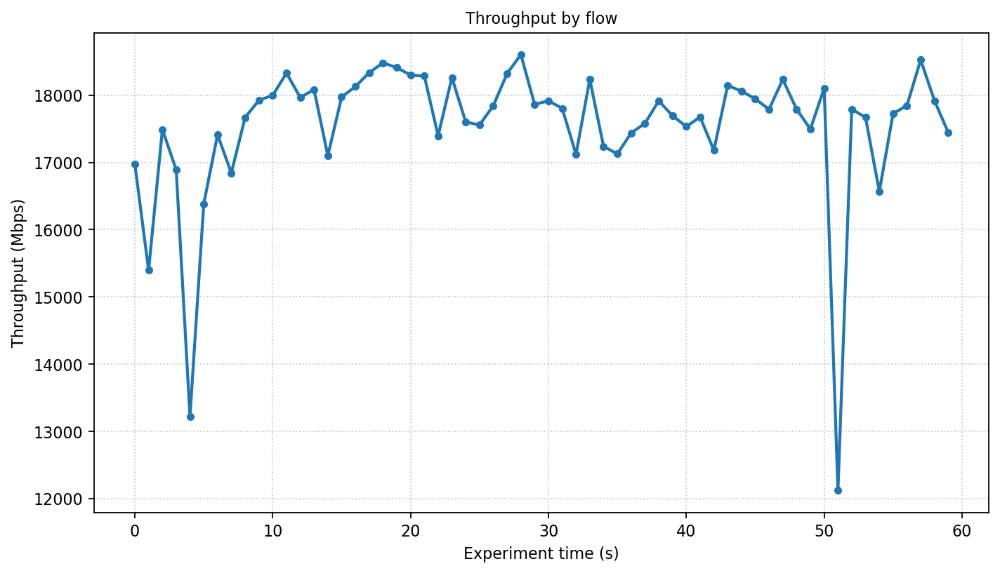
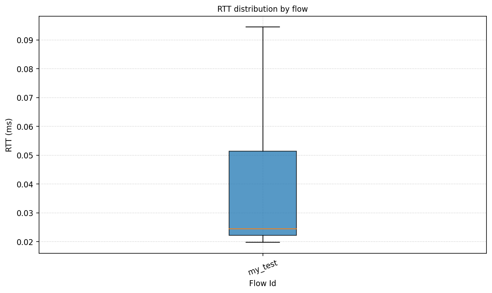
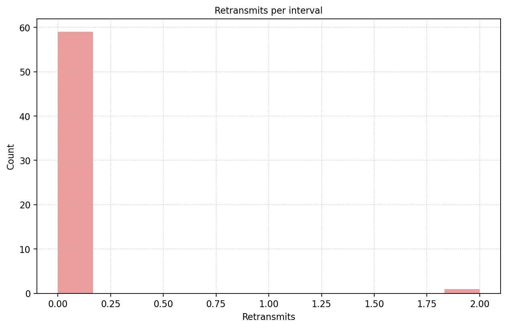

# iperf3_plotter

[](https://github.com/ekfoury/iperf3_plotter/actions/workflows/ci.yml)

`iperf3_plotter` analyzes iperf3 JSON output and produces normalized CSV files,
plots, and an HTML report.

It supports:

- One iperf3 JSON file
- Multiple JSON files from different clients
- Parallel streams created with `iperf3 -P`
- Unified experiment time for staggered or overlapping transfers
- Transfer-level plots that aggregate parallel streams
- Stream-level plots for detailed TCP behavior
- Jain fairness, bandwidth share, RTT, cwnd, retransmits, PMTU, and throughput-delay plots

The current implementation is Python-based. The original shell/gnuplot version
is preserved in `legacy/` for reference only.

## Platform Support

The plotter itself is OS-independent Python and should run on Linux, macOS, and
Windows-like Python environments. It only reads iperf3 JSON files, so `iperf3`
is required to collect data but not to analyze existing JSON.

Linux compatibility is checked with GitHub Actions on Ubuntu for Python 3.10,
3.11, and 3.12. The optional Mininet/`tc` lab needs Linux kernel features; on
macOS it runs through Docker Desktop's Linux VM.

## Requirements

- Python 3.10 or newer
- `pandas`
- `matplotlib`
- `PyYAML`
- `typer`
- `iperf3` only if you need to generate new JSON files

## Install

Use a virtual environment. This works on Linux and macOS and avoids
`externally-managed-environment` errors from distro-managed Python installs:

Install directly from GitHub:

```bash
python3 -m venv .venv
source .venv/bin/activate
python -m pip install "git+https://github.com/ekfoury/iperf3_plotter.git"
iperfplot --help
```

Or install from a local clone:

```bash
python3 -m venv .venv
source .venv/bin/activate
python -m pip install .
iperfplot --help
```

You can also use the Makefile:

```bash
make install
source .venv/bin/activate
```

If dependencies are already available in your current Python environment and
you do not want pip to resolve them, you can skip dependency installation:

```bash
python -m pip install --no-deps .
```

The Makefile version creates a venv with access to system/site packages first:

```bash
make install-offline
source .venv/bin/activate
```

For development without installing:

```bash
PYTHONPATH=src python3 -m iperf3_plotter --help
```

## Generate iperf3 JSON

Run an iperf3 server:

```bash
iperf3 -s
```

Run a client and save JSON:

```bash
iperf3 -c SERVER_IP -J -i 1 -t 30 > run1.json
```

For parallel streams:

```bash
iperf3 -c SERVER_IP -J -i 1 -t 30 -P 4 > run1.json
```

## Quick Start

Generate CSV files, plots, and an HTML report:

```bash
iperfplot all run1.json --out results
```

Open:

```text
results/report.html
```

The included sample file can be used immediately:

```bash
iperfplot all sample/my_test.json --out results
```

## Multiple Clients

If you have one JSON file per iperf3 client, pass them together:

```bash
iperfplot all client1.json client2.json client3.json --out comparison
```

By default, each file is plotted from its own time zero. To place all files on
one experiment timeline using iperf3 timestamps:

```bash
iperfplot all client1.json client2.json client3.json --time-mode global --out comparison
```

`--time-mode global` sets the earliest observed transfer to X=0. If `client2`
started 5 seconds after `client1`, `client2` appears at X=5.

## Manual Start Offsets

If JSON timestamps are missing or unreliable, use a manifest.

Create `experiment.json`:

```json
{
  "runs": [
    {
      "file": "client1.json",
      "flow_id": "client1",
      "label": "CUBIC client 1",
      "cc_algo": "cubic",
      "start_offset_s": 0
    },
    {
      "file": "client2.json",
      "flow_id": "client2",
      "label": "RENO client 2",
      "cc_algo": "reno",
      "start_offset_s": 5
    }
  ]
}
```

Run:

```bash
iperfplot all client1.json client2.json \
  --manifest experiment.json \
  --time-mode offset \
  --out comparison
```

This puts `client1` at X=0 and `client2` at X=5.

Useful manifest fields:

- `flow_id`: transfer identifier
- `label`: display label
- `cc_algo`: congestion-control algorithm
- `start_offset_s`: manual start time
- `rtt_ms`: configured RTT
- `bottleneck_mbps`: bottleneck rate
- `buffer_bdp`: buffer size in BDP units
- `scenario`: experiment name

## Commands

Run the complete pipeline:

```bash
iperfplot all *.json --out results
```

Only normalize data:

```bash
iperfplot parse *.json --out data
```

Only generate plots:

```bash
iperfplot plot *.json --out plots --format png --format pdf
```

Only generate an HTML report:

```bash
iperfplot report *.json --out report.html
```

Compute Jain fairness:

```bash
iperfplot fairness *.json --level flow
iperfplot fairness run1.json --level stream
```

Diagnose overlapping stream lines:

```bash
iperfplot diagnose run1.json
```

## Output Files

`iperfplot all` creates:

```text
results/
  data/
  plots/
  report.html
```

Important CSV files:

- `intervals.csv`: one row per stream per iperf interval
- `flow_intervals.csv`: one row per transfer per interval, with parallel streams aggregated
- `stream_time_bins.csv`: streams resampled onto common time bins
- `flow_time_bins.csv`: transfers resampled onto common time bins
- `stream_summary.csv`: throughput, RTT, and retransmit summary per stream
- `flow_summary.csv`: throughput, RTT, and retransmit summary per transfer
- `experiment_summary.csv`: one row per experiment condition for sweep plots
- `flow_fairness.csv`: Jain fairness over time among active transfers
- `stream_fairness.csv`: Jain fairness over time among active streams
- `flow_share.csv`: bandwidth share over time among active transfers
- `stream_share.csv`: bandwidth share over time among active streams
- `stream_similarity.csv`: pairwise checks for nearly identical stream time series

## Plot Types

Transfer-level plots aggregate parallel streams belonging to the same JSON file
or manifest `flow_id`:

- Aggregate throughput
- RTT and RTT variation
- Congestion window
- Retransmits and cumulative retransmits
- Cumulative transferred data
- PMTU
- Bandwidth share
- Jain fairness

Stream-level plots show each iperf3 stream separately:

- Per-stream throughput
- Throughput deviation from the interval mean
- RTT and RTT variation
- Congestion window
- Retransmits and cumulative retransmits
- Cumulative transferred data
- PMTU
- Parallel-stream fairness

Experiment-level plots include:

- Total aggregate throughput
- Throughput-delay scatter plot
- Average throughput by stream

## Advanced Features

For a detailed, end-to-end guide with JSON snippets, manifests, generated
figures, and BBRv3-style experiment workflows, see
[docs/research_workflows.md](docs/research_workflows.md).

### Reproduce BBRv3 Paper Figures

This repository includes an example script that regenerates selected figures
from the public BBRv3 experiment repository instead of using toy sample data.
It downloads the needed upstream JSON/`.dat` artifacts on demand and caches
them under `.cache/bbr3-paper`.

```bash
python3 examples/reproduce_bbr3_paper.py --out docs/images/bbr3
```

Generated examples:

| Throughput vs RTT | Staggered Flow Fairness |
| --- | --- |
|  |  |

See [docs/research_workflows.md](docs/research_workflows.md#reproducing-bbrv3-paper-figures)
for the full regenerated figure gallery and the supported `--figure` options.

### Custom Plot Specs

For research sweeps, put experiment metadata in the manifest and describe plots
in YAML or JSON. Any manifest column that is not one of the built-in fields is
preserved in the derived tables, so columns such as `propagation_delay_ms`,
`loss_percent`, `aqm`, `num_flows`, and `trial` can be used for grouping,
filtering, faceting, and heatmaps.

Generate only user-defined plots:

```bash
iperfplot custom *.json --manifest experiment.csv --plot-spec plots.yaml --out plots
```

Add custom plots to the normal data/plots/report pipeline:

```bash
iperfplot all *.json --manifest experiment.csv --plot-spec plots.yaml --out results
```

Example spec:

```yaml
plots:
  - name: rtt_cdf_by_flow
    kind: cdf
    source: flow_intervals
    metric: rtt_ms
    group_by: flow_id
    title: RTT CDF by flow
    x_label: RTT (ms)
    figsize: [7.5, 4.8]
    dpi: 180
    legend: false
    color: "#1f77b4"
    linewidth: 2.2

  - name: fairness_heatmap
    kind: heatmap
    source: experiment_summary
    x: propagation_delay_ms
    y: bottleneck_mbps
    value: jain_fairness
    facet_by: [buffer_bdp, loss_percent]
    annotations:
      - link_utilization_percent
      - share_cubic_percent
      - share_bbrv2_percent
    figsize: [8.5, 6.4]
    cmap: YlGnBu
    annotation_color: black
    annotation_fontsize: 7
```

Run:

```bash
iperfplot all *.json --manifest experiment.csv --plot-spec plots.yaml --out results
```

### Example Plot Gallery

These examples are generated from `sample/my_test.json` with
`examples/custom_plots.yaml`.

| RTT CDF | Throughput Time Series |
| --- | --- |
|  |  |

| RTT Box Plot | Retransmit Histogram |
| --- | --- |
|  |  |

Regenerate the gallery:

```bash
PYTHONPATH=src python3 -m iperf3_plotter custom \
  sample/my_test.json \
  --plot-spec examples/custom_plots.yaml \
  --out docs/images \
  --format png
```

Supported custom plot kinds:

- `cdf` and `ccdf`
- `histogram`
- `line`
- `time_series`
- `scatter`
- `bar`
- `box`
- `heatmap`

Common style and layout options:

- `figsize: [width, height]`, `dimensions: [width, height]`, or separate `width` / `height`, in Matplotlib inches
- `dpi`: output resolution
- `legend: false` or `legend: {show: true, loc: lower right, anchor: null, frame: true}`
- `color`: one color for the plot
- `colors`: a list of colors or a mapping from series label to color
- `palette`: Matplotlib colormap name such as `tab10`, `Set2`, or `viridis`
- `linewidth`, `linestyle`, `alpha`, `marker`, `marker_size`
- `bar_width`, `bins`, `grid`, `x_tick_rotation`, `y_tick_rotation`
- `cmap`, `colorbar`, `annotation_color`, and `annotation_fontsize` for heatmaps
- `xlim`, `ylim`, `log_x`, and `log_y`

Style options can be placed directly on the plot or inside a `style` object.

Useful plot sources:

- `intervals`: one row per stream interval
- `flow_intervals`: parallel streams aggregated per transfer interval
- `stream_time_bins` and `flow_time_bins`: common time-grid versions
- `stream_summary` and `flow_summary`: one row per stream or transfer
- `stream_fairness` and `flow_fairness`: Jain fairness over time
- `stream_share` and `flow_share`: bandwidth share over time
- `experiment_summary`: one row per experiment condition, with total throughput, Jain fairness, link utilization, and per-`cc_algo` shares

See `examples/custom_plots.yaml` for a runnable sample spec and
`examples/paper_style_plots.yaml` for sweep plots that expect manifest columns
such as `propagation_delay_ms`, `bottleneck_mbps`, `buffer_bdp`, and
`loss_percent`.

### Paper-Style Scenario Specs

`examples/paper_style_plots.yaml` is a scenario catalog inspired by the plots in
Kfoury et al., "Performance Evaluation of TCP BBRv2 Alpha for Wired Broadband,
considering Buffer Sizes, Packet Loss Rates, RTTs, and Number of Flows"
([PDF](https://gomezgaona.github.io/online-cv/assets/pdfs/1-s2.0-S014036642030092X-main.pdf)).

The file includes templates for these experiment families:

| Scenario | Paper-style plot | Example spec names |
| --- | --- | --- |
| Same-CCA multi-flow buffer sweep | Throughput and link-utilization CDFs across buffer sizes and loss rates | `flow_throughput_cdf_by_buffer_and_loss`, `link_utilization_cdf_by_buffer_and_loss` |
| Flow-count scaling | Retransmissions and RTT as the number of competing flows changes | `retransmits_vs_number_of_flows`, `rtt_vs_number_of_flows` |
| Packet-loss sensitivity | Throughput and retransmissions as random packet loss changes | `throughput_vs_packet_loss`, `retransmits_vs_packet_loss` |
| CUBIC/BBR coexistence | Fairness and bandwidth share as buffer size or flow mix changes | `coexistence_fairness_vs_buffer`, `coexistence_cubic_share_vs_buffer`, `cubic_share_vs_bbrv2_flow_count`, `bbrv2_share_vs_bbrv2_flow_count` |
| Bandwidth-delay sweep | Fairness heatmap with link utilization and per-CCA share annotations | `fairness_heatmap_bandwidth_delay_sweep` |
| RTT unfairness | Throughput and fairness for flows with different RTTs and AQM policies | `rtt_unfairness_throughput_vs_buffer`, `rtt_unfairness_fairness_vs_buffer` |
| AQM retransmissions | Retransmissions under Tail Drop, FQ-CoDel, CAKE, or ECN variants | `rtt_unfairness_retransmits_vs_buffer` |
| Flow completion time | Mean FCT and FCT CDFs across buffer sizes, loss rates, and CCA mixes | `fct_vs_buffer`, `fct_cdf_by_buffer_and_loss` |
| AQM fairness | Jain fairness as a function of buffer size and queue policy | `aqm_fairness_vs_buffer` |

Typical manifest columns for these specs:

```csv
file,flow_id,cc_algo,tested_cc_algo,cc_mix,buffer_bdp,loss_percent,num_flows,num_cubic_flows,num_bbrv2_flows,propagation_delay_ms,bottleneck_mbps,aqm,trial,start_offset_s
run1.json,flow1,cubic,cubic,cubic_only,1,0,100,100,0,100,1000,taildrop,1,0
```

### Time Modes

- `relative`: each JSON file starts at X=0
- `global`: align files by iperf3 timestamps and normalize the earliest start to X=0
- `offset`: use `start_offset_s` values from a manifest
- `wall`: use raw Unix time from iperf3 timestamps

If you pass multiple JSON files and do not set `--time-mode`, `iperfplot`
warns before using the default `relative` mode. For staggered clients, use
`--time-mode global` when client clocks are synchronized, or use a manifest
with `--time-mode offset` when you know the intended start offsets.

Examples:

```bash
iperfplot all *.json --time-mode relative --out results
iperfplot all *.json --time-mode global --out results
iperfplot all *.json --manifest experiment.json --time-mode offset --out results
```

### Compatibility Wrappers

These wrappers are kept for users of the old script names:

```bash
./plot_iperf.sh run1.json --out results
./preprocessor.sh run1.json data
./fairness.sh run1.json --level flow
```

The maintained interface is `iperfplot`.

### Optional Test Lab

The `lab/` directory contains a Docker-based Mininet/iperf3 testbed. It runs
Mininet and `tc` inside Linux, generates iperf3 JSON files, writes a manifest,
and runs the plotter.

On Linux, start Docker. On macOS, start Docker Desktop. Then run:

```bash
make lab
```

To test overlapping transfers with parallel streams:

```bash
make lab-overlap
```

The lab writes:

```text
lab-results/raw/*.json
lab-results/experiment.json
lab-results/analysis/report.html
```

Docker Desktop may not expose every TCP congestion-control algorithm. If a
requested algorithm is unavailable, the lab falls back to `cubic` or `reno` and
records both the requested and actual algorithms in the manifest.

## Development

Run tests:

```bash
make test
```

Remove generated outputs:

```bash
make clean
```
