# Experiment File Guide

This page explains how to use one `experiment.yaml` file to describe input JSON
files, experiment metadata, time alignment, and custom plots. The examples are
inspired by TCP congestion-control evaluations, but the same format works for
simple iperf3 comparisons too.

Inspirational references:

- BBRv3 experiment repository: <https://github.com/gomezgaona/bbr3/tree/main>
- BBRv3 paper PDF: <https://par.nsf.gov/servlets/purl/10545111>

The workflow is:

1. Generate one iperf3 JSON file per client transfer.
2. Describe the experiment in `experiment.yaml`.
3. Run `iperfplot experiment experiment.yaml --out results`.

There is no separate metadata file required in the main workflow. The
experiment file contains the input mapping, run metadata, and plot definitions.

## Generate The Showcase

The figures on this page are generated by the tool from synthetic iperf3 JSON
files. The synthetic data is shaped like common BBRv3 paper scenarios, but it
does not vendor or claim to reproduce the referenced repository's measurements.

```bash
python3 examples/generate_bbr3_showcase_data.py \
  --out /tmp/iperf3-plotter-bbr3-showcase

PYTHONPATH=src python3 -m iperf3_plotter experiment \
  /tmp/iperf3-plotter-bbr3-showcase/experiment.yaml \
  --out /tmp/iperf3-plotter-bbr3-showcase/results \
  --format png
```

The generated file at `/tmp/iperf3-plotter-bbr3-showcase/experiment.yaml`
contains all inputs, metadata, and plots.

## Experiment File Shape

This is the general shape:

```yaml
name: my_tcp_experiment
time_mode: offset
default_plots: true

inputs:
  runs:
    - file: runs/client1.json
      flow_id: client1
      flow_label: CUBIC client
      cc_algo: cubic
      start_offset_s: 0
      rtt_ms: 20
      buffer_bdp: 1
      trial: 1
    - file: runs/client2.json
      flow_id: client2
      flow_label: BBRv3 client
      cc_algo: bbrv3
      start_offset_s: 5
      rtt_ms: 20
      buffer_bdp: 1
      trial: 1

plots:
  - name: throughput_by_flow
    type: time_series
    data:
      source: flow_time_bins
      x: time_bin_start_s
      y: throughput_mbps
      group_by: flow_label
    display:
      x_label: Experiment time (s)
      y_label: Throughput (Mbps)
      palette: tab10
```

Run it:

```bash
iperfplot validate experiment.yaml
iperfplot experiment experiment.yaml --out results
```

## Mapping JSON Files

The safest mapping is explicit:

```yaml
inputs:
  runs:
    - file: runs/rtt20/client1.json
      flow_id: rtt20_cubic_trial1
      cc_algo: cubic
      rtt_ms: 20
      trial: 1
```

This requires no filename convention. It is best when your files already exist
with inconsistent names.

For large sweeps, use a filename convention as a shortcut. The easier form is
`filename_pattern`, where `{field}` placeholders become metadata columns:

```yaml
inputs:
  files: runs/buffer-rtt/*.json

defaults:
  scenario: buffer_rtt_sweep
  bottleneck_mbps: 1000

infer:
  filename_pattern: "{aqm}_rtt{rtt_ms}_bdp{buffer_bdp}_trial{trial}_flow{flow_index}_{cc_algo}.json"
```

With that pattern, this filename:

```text
taildrop_rtt50_bdp1_trial2_flow3_bbrv3.json
```

becomes:

```yaml
aqm: taildrop
rtt_ms: 50
buffer_bdp: 1
trial: 2
flow_index: 3
cc_algo: bbrv3
```

The `flow_id` defaults to the filename stem when you do not provide one. That
is usually the safest choice because `flow_id` should identify one transfer
uniquely across the experiment.

If one file does not follow the filename convention, list that file explicitly:

```yaml
inputs:
  files: runs/buffer-rtt/*.json
  runs:
    - file: runs/weird-name.json
      flow_id: flow17
      cc_algo: cubic
      rtt_ms: 100
```

## Plot Sources And Grouping Fields

In every plot, `data.source` selects the table to plot. The other data fields
then refer to columns in that table:

- `x`, `y`, and `value` choose the plotted metric columns.
- `filter` keeps only rows whose columns match the requested values.
- `group_by` splits one plot into one line, bar, CDF, box, or histogram per
  column value.
- `facet_by` creates separate plot files per column value.
- `annotations` adds extra heatmap text from one or more columns.

After running an experiment, open the matching CSV under `results/data/` to see
the exact available columns. For example, if a plot uses
`source: flow_time_bins`, inspect `results/data/flow_time_bins.csv`. If
`validate` reports `missing column(s)`, the field is not present in the
selected source.

Supported plot sources:

| Source | CSV | Use For |
| --- | --- |
| `intervals` | `intervals.csv` | one row per stream per original iperf interval |
| `flow_intervals` | `flow_intervals.csv` | one row per transfer per original interval, with parallel streams aggregated |
| `stream_time_bins` | `stream_time_bins.csv` | per-stream samples aligned onto common time bins |
| `flow_time_bins` | `flow_time_bins.csv` | per-transfer samples aligned onto common time bins |
| `total_time_bins` | `total_time_bins.csv` | total throughput across all active transfers per common time bin |
| `total_intervals` | `total_intervals.csv` | total throughput across all active transfers at original interval starts |
| `summaries` | `summaries.csv` | raw iperf3 end summaries, including sender/receiver and aggregate rows |
| `runs` | `runs.csv` | one row per JSON input file with run metadata |
| `stream_summary` | `stream_summary.csv` | one row per parallel stream |
| `flow_summary` | `flow_summary.csv` | one row per transfer, with parallel streams aggregated |
| `stream_fairness` | `stream_fairness.csv` | Jain fairness over time among active streams |
| `flow_fairness` | `flow_fairness.csv` | Jain fairness over time among active transfers |
| `stream_share` | `stream_share.csv` | bandwidth share over time for each stream |
| `flow_share` | `flow_share.csv` | bandwidth share over time for each transfer |
| `experiment_summary` | `experiment_summary.csv` | one row per experiment condition, with total throughput, fairness, utilization, and per-CCA share columns |

Use `stream_*` sources when you want to inspect individual parallel streams.
Use `flow_*` sources for the transfer-level plots that papers usually show.
Use `total_*` sources when the figure should show the aggregate load on the
link instead of individual transfers.

`group_by` can be any column in the selected source. The most common choices
are:

| Grouping Field | Meaning |
| --- | --- |
| `flow_label` | readable transfer label from `inputs.runs` |
| `flow_id` | unique transfer id; defaults to the filename stem |
| `stream_id` or `stream_index` | individual parallel streams from `iperf3 -P` |
| `cc_algo` | congestion-control algorithm or implementation label |
| `scenario` | experiment scenario, useful when one YAML contains multiple studies |
| `rtt_ms` | configured RTT in `flow_summary`, `stream_summary`, and `runs`; measured RTT in interval/time-bin sources |
| `buffer_bdp`, `bottleneck_mbps`, `loss_percent`, `aqm`, `trial`, `host` | experiment metadata supplied by you |

Custom metadata from `inputs.runs`, `defaults`, or `infer.filename_pattern`
becomes columns that can be used in `filter`, `group_by`, `facet_by`, `x`, `y`,
or `value` when that metadata is present in the selected source.

## Reusable Plot Fields

The same plot fields work across plot types:

```yaml
plots:
  - name: example
    type: line
    data:
      source: flow_summary
      filter:
        scenario: rtt_sweep
      x: rtt_ms
      y: avg_throughput_mbps
      group_by: cc_algo
      facet_by: aqm
      aggregate: mean
    display:
      title: Example
      x_label: RTT (ms)
      y_label: Throughput (Mbps)
      legend: true
      size: [7.2, 5.0]
      colors:
        cubic: "#2D72B7"
        bbrv3: "#95253B"
```

`filter` means "use only rows matching these metadata values." You only need it
when one experiment file contains multiple scenarios. If the file contains only
one scenario, omit it.

`facet_by` means "make one separate plot per value." For example, `facet_by:
aqm` creates one Tail Drop plot and one FQ-CoDel plot from the same plot
definition.

`rtt_ms` in experiment metadata is the configured RTT. In `flow_summary`,
`stream_summary`, and `runs`, the tool maps it to the internal column
`rtt_config_ms`, so users can write the friendlier `rtt_ms` in the experiment
file. Measured RTT samples are still available as `rtt_ms` in interval and
time-bin sources, and as `mean_rtt_ms` / `p95_rtt_ms` in summaries.

## Ten JSON Files With Filename Pattern: Throughput Vs RTT

Use this for paper-style figures where the x-axis is configured RTT and the
series are congestion-control algorithms.

This complete example uses 10 iperf3 JSON files: five configured RTT values
times two congestion-control algorithms. The user does not list the 10 files
one by one. `inputs.files` finds them with a glob, and
`infer.filename_pattern` extracts metadata from each filename.

Expected files:

```text
runs/rtt_sweep_cubic_rtt2.json
runs/rtt_sweep_bbrv3_rtt2.json
runs/rtt_sweep_cubic_rtt20.json
runs/rtt_sweep_bbrv3_rtt20.json
runs/rtt_sweep_cubic_rtt40.json
runs/rtt_sweep_bbrv3_rtt40.json
runs/rtt_sweep_cubic_rtt80.json
runs/rtt_sweep_bbrv3_rtt80.json
runs/rtt_sweep_cubic_rtt100.json
runs/rtt_sweep_bbrv3_rtt100.json
```

```yaml
name: rtt_sweep

defaults:
  scenario: rtt_sweep
  loss_percent: 0.025
  bottleneck_mbps: 1000

inputs:
  files: runs/rtt_sweep_*.json

infer:
  filename_pattern: "rtt_sweep_{cc_algo}_rtt{rtt_ms}.json"

plots:
  - name: throughput_vs_rtt
    type: line
    data:
      source: flow_summary
      filter: {scenario: rtt_sweep}
      x: rtt_ms
      y: avg_throughput_mbps
      group_by: cc_algo
      aggregate: mean
    display:
      x_label: Configured RTT (ms)
      y_label: Average throughput (Mbps)
      marker: o
      colors: {cubic: "#2D72B7", bbrv3: "#95253B"}
```

Run it:

```bash
iperfplot validate rtt_sweep_10_files.yaml
iperfplot experiment rtt_sweep_10_files.yaml --out results/rtt-sweep --format png
```

For example, `rtt_sweep_bbrv3_rtt80.json` becomes:

```yaml
cc_algo: bbrv3
rtt_ms: 80
scenario: rtt_sweep
loss_percent: 0.025
bottleneck_mbps: 1000
```

The `flow_id` defaults to the filename stem, so each JSON file still becomes
one transfer even though it was discovered automatically.

The plot reads `flow_summary`, so if any JSON file was generated with
`iperf3 -P`, its parallel streams are aggregated into one throughput value for
that transfer before the line is drawn.

| Throughput vs RTT |
| --- |
| 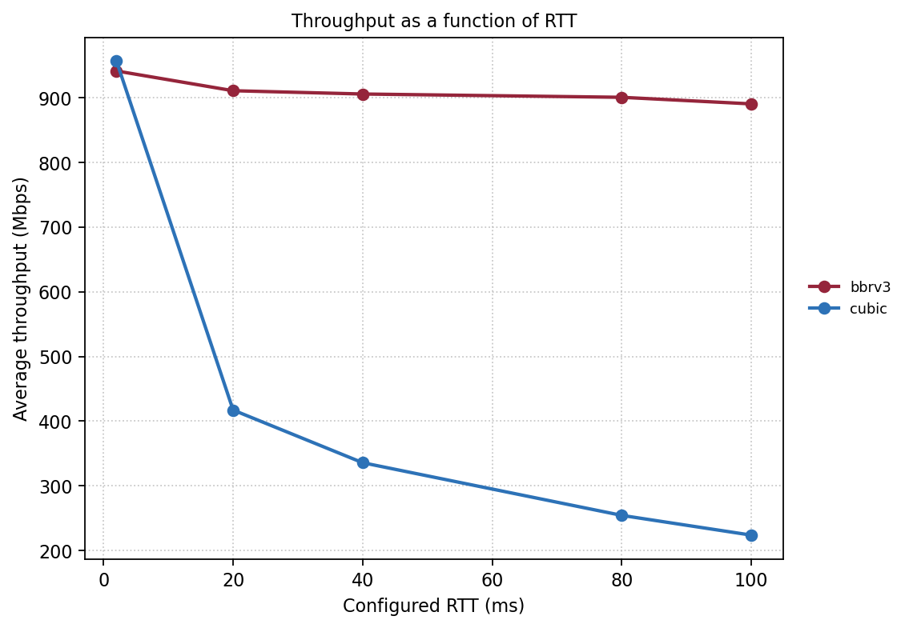 |

## Throughput And Retransmissions Vs Loss

Use this for random-loss sensitivity plots.

```yaml
plots:
  - name: throughput_vs_loss
    type: line
    data:
      source: flow_summary
      filter: {scenario: loss_sweep}
      x: loss_percent
      y: avg_throughput_mbps
      group_by: cc_algo
      aggregate: mean
    display:
      x_label: Random packet loss (%)
      y_label: Average throughput (Mbps)
      marker: o
      log_x: true

  - name: retransmits_vs_loss
    type: line
    data:
      source: flow_summary
      filter: {scenario: loss_sweep}
      x: loss_percent
      y: retransmits
      group_by: cc_algo
      aggregate: mean
    display:
      x_label: Random packet loss (%)
      y_label: Retransmissions (packets)
      marker: o
      log_x: true
      log_y: true
```

| Throughput vs Loss | Retransmissions vs Loss |
| --- | --- |
| 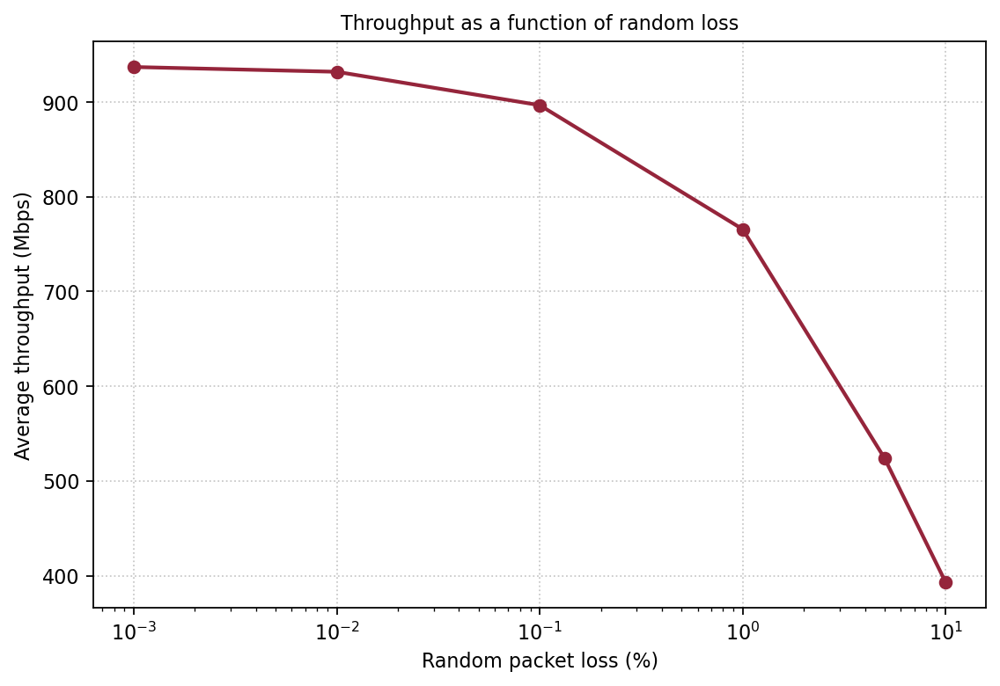 | 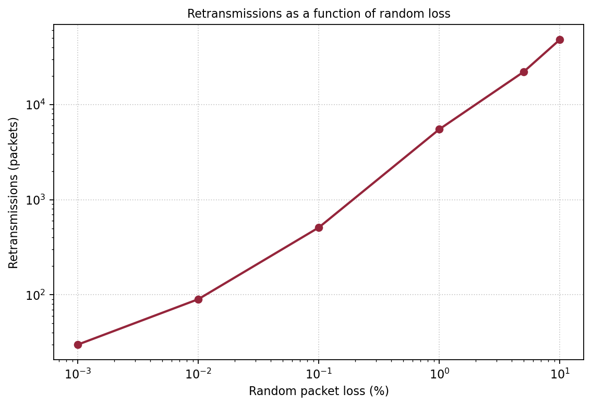 |

## RTT And Buffer Heatmap

This is the realistic heatmap case: x-axis is configured RTT, y-axis is buffer
size, and each cell is average throughput across multiple flows and repeated
trials. Each JSON file may contain multiple parallel streams.

```yaml
name: buffer_rtt_sweep

inputs:
  files: runs/buffer_rtt/*.json

defaults:
  scenario: buffer_rtt_sweep
  bottleneck_mbps: 1000

infer:
  filename_pattern: "buffer_rtt_{aqm}_rtt{rtt_ms}_bdp{buffer_bdp}_trial{trial}_flow{flow_index}_{cc_algo}.json"

plots:
  - name: avg_flow_throughput_heatmap
    type: heatmap
    data:
      source: flow_summary
      filter:
        scenario: buffer_rtt_sweep
      x: rtt_ms
      y: buffer_bdp
      value: avg_throughput_mbps
      aggregate: mean
      facet_by: aqm
    display:
      title: Average flow throughput over RTT and buffer size
      x_label: Configured RTT (ms)
      y_label: Buffer size (BDP)
      value_label: Throughput (Mbps)
      cmap: YlGnBu
      annotation_color: black
      size: [7.5, 5.8]
```

How the cell value is computed:

- iperf3 parallel streams inside one JSON file are summed into one transfer in `flow_summary`.
- Each transfer contributes one `avg_throughput_mbps` value.
- Rows with the same `aqm`, `rtt_ms`, and `buffer_bdp` are grouped together.
- `aggregate: mean` averages across all flows and all trials in that cell.
- `facet_by: aqm` creates one heatmap per queue policy.

| Tail Drop | FQ-CoDel |
| --- | --- |
| 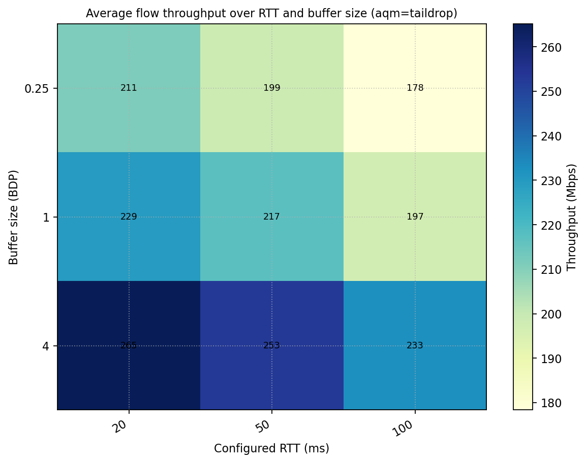 |  |

## RTT Unfairness And AQM

Use this when competing flows have different configured RTTs and you want to
compare queue policies.

```yaml
plots:
  - name: rtt_unfairness_throughput_vs_buffer
    type: line
    data:
      source: flow_summary
      filter: {scenario: rtt_unfairness}
      x: buffer_bdp
      y: avg_throughput_mbps
      group_by: rtt_ms
      facet_by: aqm
      aggregate: mean
    display:
      x_label: Buffer size (BDP)
      y_label: Average throughput (Mbps)
      marker: o
      log_x: true

  - name: rtt_unfairness_fairness_vs_buffer
    type: line
    data:
      source: experiment_summary
      filter: {scenario: rtt_unfairness}
      x: buffer_bdp
      y: jain_fairness
      group_by: aqm
      aggregate: mean
    display:
      x_label: Buffer size (BDP)
      y_label: Jain fairness
      ylim: [0, 1.05]
      marker: o
      log_x: true
```

| Tail Drop Throughput Split | FQ-CoDel Throughput Split |
| --- | --- |
| 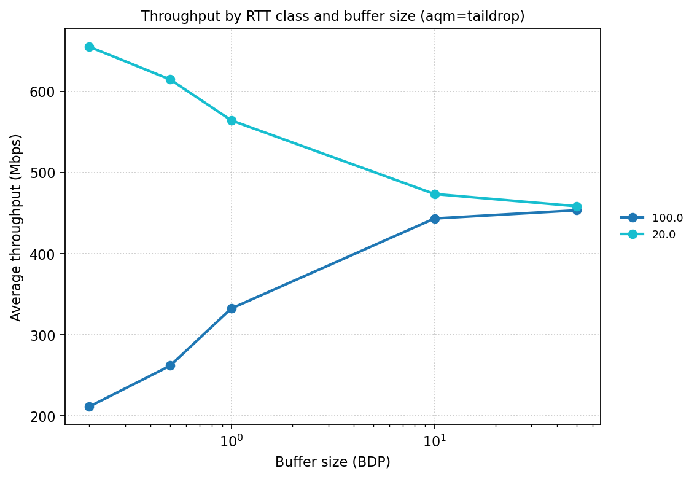 | 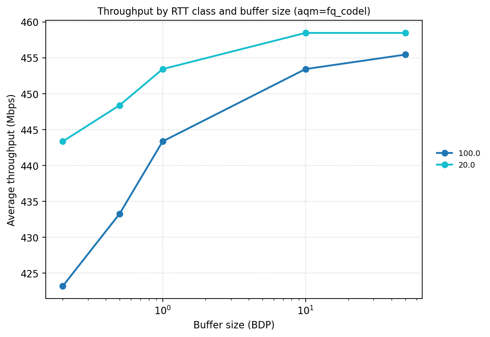 |

| Fairness vs Buffer |
| --- |
| 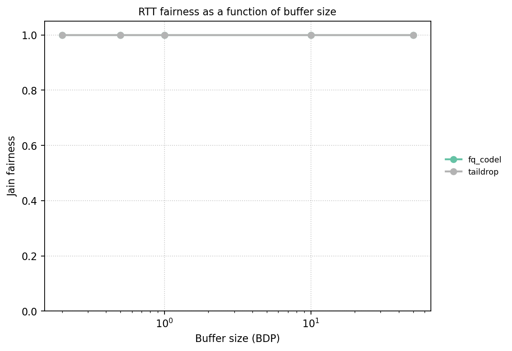 |

## Staggered Flow Starts

Use `time_mode: offset` and put intended start times in `start_offset_s`.

```yaml
name: staggered_coexistence
time_mode: offset

inputs:
  runs:
    - file: runs/staggered_cubic.json
      flow_id: cubic_long
      flow_label: CUBIC flow
      scenario: staggered_coexistence
      cc_algo: cubic
      start_offset_s: 0
    - file: runs/staggered_bbrv3_1.json
      flow_id: bbrv3_1
      flow_label: BBRv3 flow 1
      scenario: staggered_coexistence
      cc_algo: bbrv3
      start_offset_s: 40

plots:
  - name: staggered_flow_throughput
    type: time_series
    data:
      source: flow_time_bins
      filter: {scenario: staggered_coexistence}
      x: time_bin_start_s
      y: throughput_mbps
      group_by: flow_label
    display:
      x_label: Experiment time (s)
      y_label: Throughput (Mbps)
      palette: tab10

  - name: staggered_flow_fairness
    type: line
    data:
      source: flow_fairness
      filter: {scenario: staggered_coexistence}
      x: time_bin_start_s
      y: jain_fairness
    display:
      x_label: Experiment time (s)
      y_label: Jain fairness
      ylim: [0, 1.05]
```

| Staggered Throughput | Staggered Fairness |
| --- | --- |
| 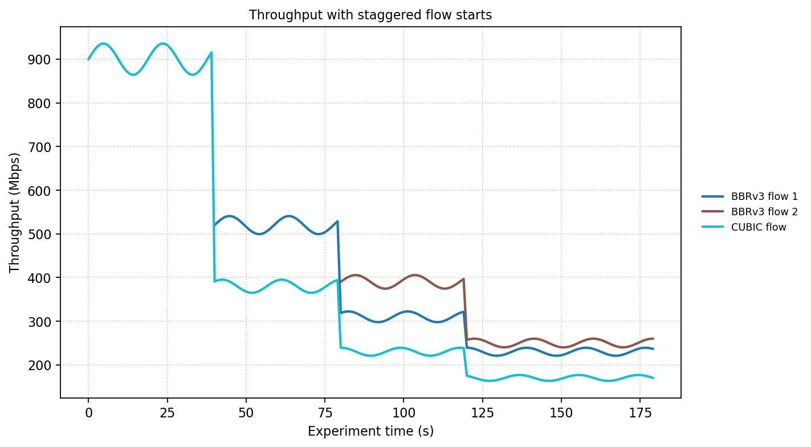 | 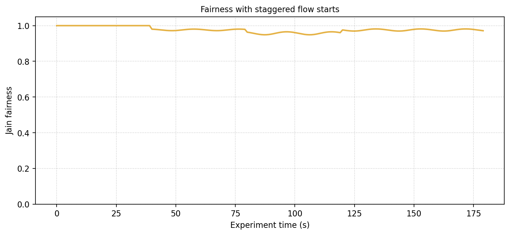 |

## Flow Completion Time CDF

For fixed-size transfers created with `iperf3 -n SIZE`, the transfer duration is
available as `flow_summary.duration_s`.

```yaml
plots:
  - name: fct_cdf_by_cc
    type: cdf
    data:
      source: flow_summary
      filter: {scenario: fct}
      value: duration_s
      group_by: cc_algo
    display:
      x_label: Flow completion time (s)
      colors: {cubic: "#2D72B7", bbrv3: "#95253B"}
```

| Flow Completion Time CDF |
| --- |
| 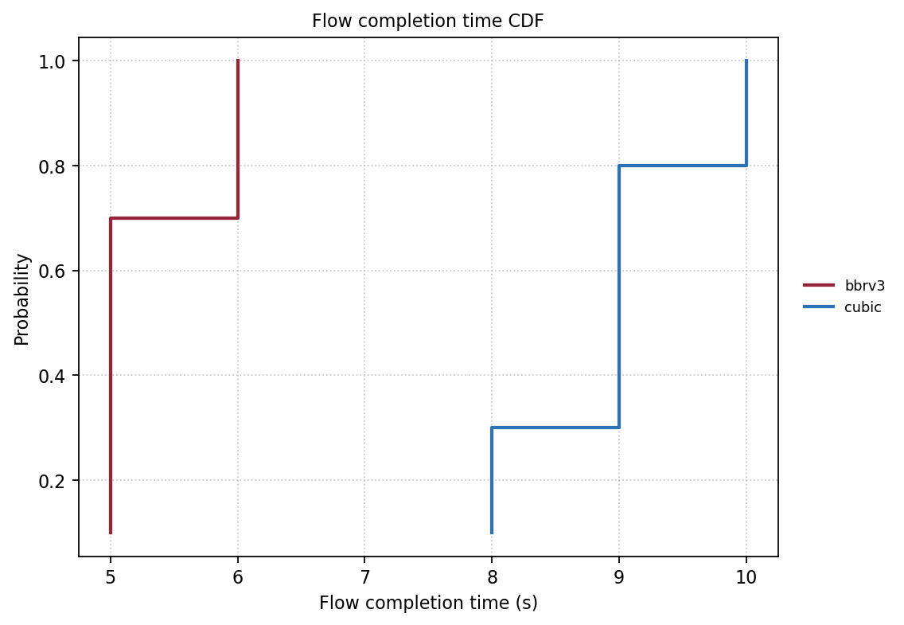 |

## Bandwidth-Delay Heatmap

Use `experiment_summary` when each heatmap cell represents a full experiment
condition. This source includes total throughput, Jain fairness, link
utilization, and per-`cc_algo` share columns.

```yaml
plots:
  - name: fairness_heatmap_bandwidth_delay
    type: heatmap
    data:
      source: experiment_summary
      filter: {scenario: bdp_sweep}
      x: propagation_delay_ms
      y: bottleneck_mbps
      value: jain_fairness
      annotations:
        - link_utilization_percent
        - share_cubic_percent
        - share_bbrv3_percent
    display:
      x_label: Configured RTT or propagation delay (ms)
      y_label: Bottleneck bandwidth (Mbps)
      value_label: Jain fairness
      cmap: YlGnBu
      annotation_color: black
```

| Bandwidth-Delay Fairness Heatmap |
| --- |
| 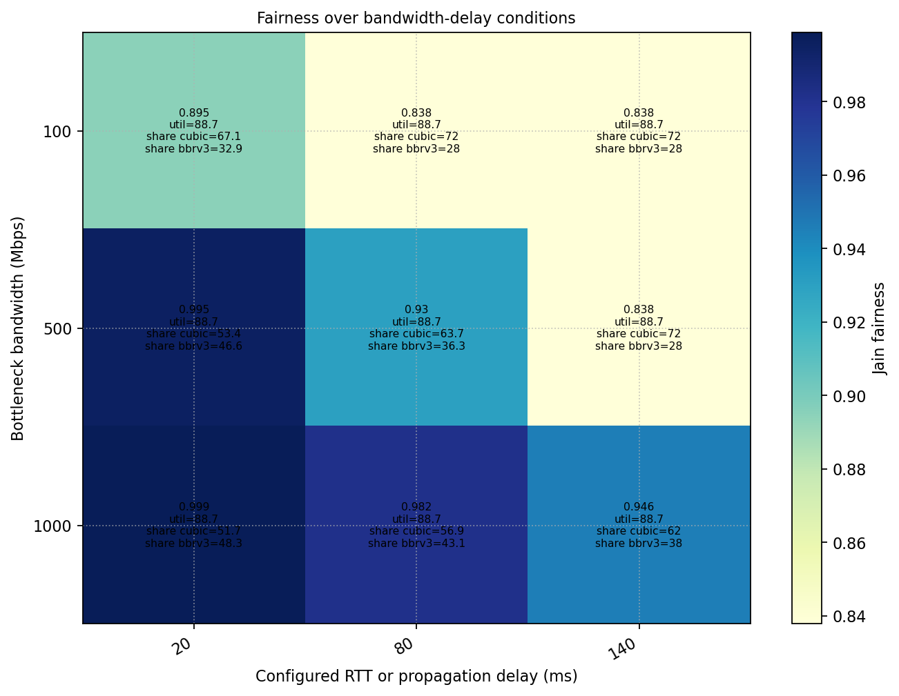 |

## Style Options

Common display options:

```yaml
display:
  title: My plot title
  x_label: X label
  y_label: Y label
  value_label: Heatmap colorbar label
  legend:
    show: true
    loc: center left
    anchor: [1.02, 0.5]
  size: [7.2, 5.0]
  dpi: 180
  color: "#2D72B7"
  colors:
    cubic: "#2D72B7"
    bbrv3: "#95253B"
  palette: tab10
  cmap: YlGnBu
  marker: o
  line_width: 2.0
  log_x: true
  ylim: [0, 1.05]
```

Use `legend: false` to hide the legend.

## What iperf3 JSON Can Provide

From iperf3 JSON alone, the tool can plot throughput, transfer size,
retransmissions, TCP RTT samples, RTT variation, congestion window, PMTU, loss
fields when present, stream-level behavior, flow-level aggregates, fairness,
bandwidth shares, and FCT for fixed-size transfers. Link utilization is also
available when the experiment metadata includes `bottleneck_mbps`.

Some paper figures need telemetry that is not in iperf3 JSON. Queue occupancy,
AQM drop/mark counts, switch counters, host CPU, and qdisc backlog must be
collected separately. You can still encode configured queue policy as `aqm`, but
true queue-occupancy plots need another data source.

## Common Issues

`missing column(s)`:

The plot references a column that is not in the selected `source`. Inspect the
matching file under `results/data/`, such as `flow_summary.csv` for
`source: flow_summary`.

All flows start at X=0:

Use `time_mode: global` if iperf3 timestamps are synchronized, or
`time_mode: offset` with `start_offset_s` if you know the intended start times.

Heatmap has no output:

Check that each row has values for the heatmap `x`, `y`, and `value` fields.

`infer rule did not match input file`:

At least one JSON filename did not match `infer.filename_pattern`. Either fix
the filename, adjust the pattern, or list that file explicitly under
`inputs.runs`.

Share column is missing:

Per-CCA share columns are generated from `cc_algo`. For example,
`cc_algo: bbrv3` produces `share_bbrv3_percent`.
