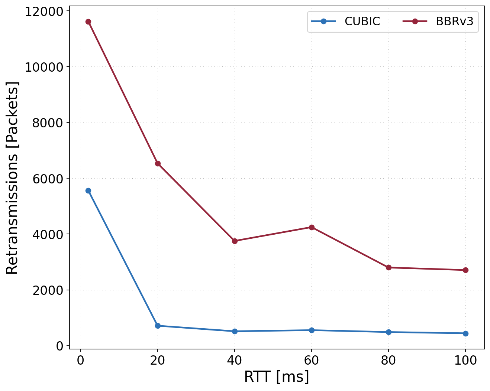
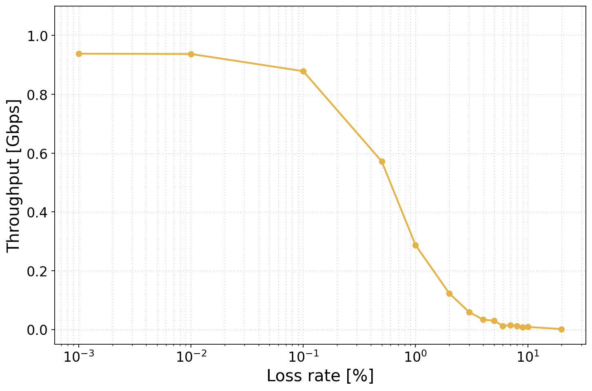
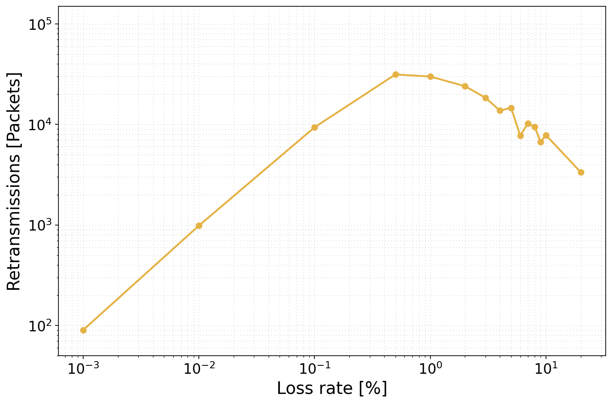
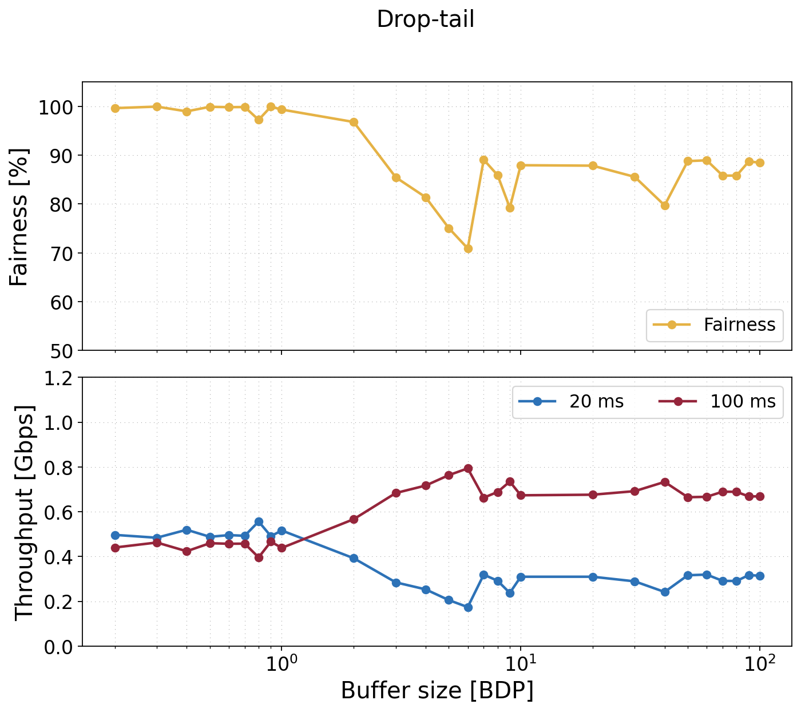
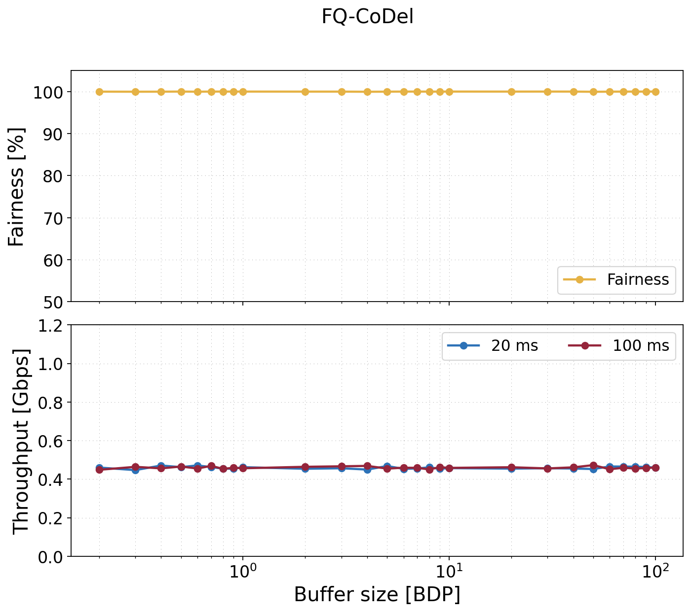
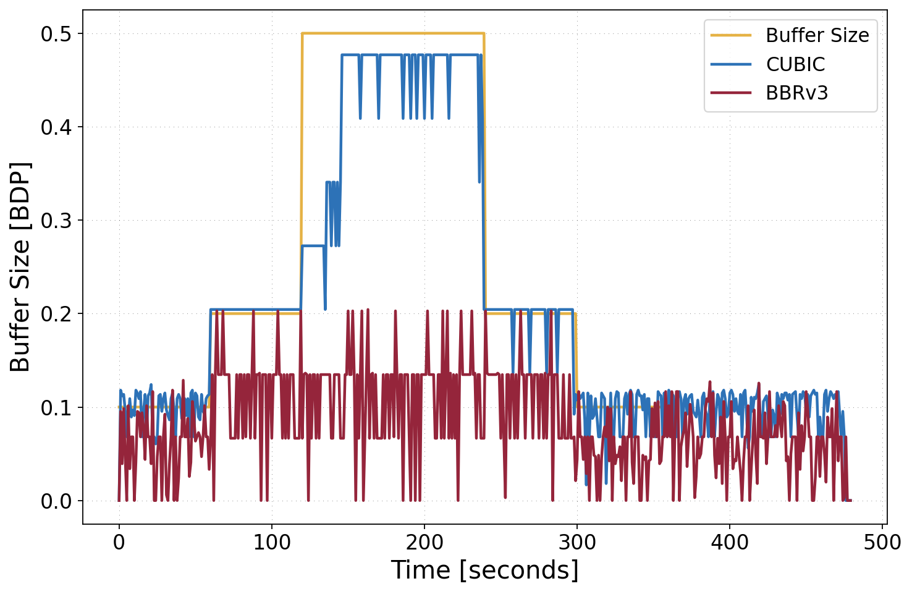

# Research Workflow Examples

This page shows how to use `iperf3_plotter` for research-style TCP experiments:
multiple clients, parallel streams, different start times, congestion-control
algorithms, buffer sweeps, packet-loss sweeps, RTT unfairness, AQM comparisons,
and paper-style plots.

The examples are inspired by the BBRv3 repository and paper:

- BBRv3 experiment repository: <https://github.com/gomezgaona/bbr3/tree/main>
- BBRv3 paper PDF: <https://par.nsf.gov/servlets/purl/10545111>

The BBRv3 repository contains experiment directories such as `CDF_BBR`,
`RTT_Unfairness`, `retrans_loss`, `fairness_time`, `q_occupancy`, and
`total-share`. Some directories include iperf JSON files, while others include
experiment scripts, `.dat` files, and already-generated PDF figures. This tool
works from iperf3 JSON files; the manifest provides the missing experiment
metadata.

## Data Model

At minimum, each input file should be an iperf3 JSON file generated with `-J`:

```bash
iperf3 -c SERVER_IP -J -i 1 -t 60 > runs/cubic_1.json
```

For parallel streams:

```bash
iperf3 -c SERVER_IP -J -i 1 -t 60 -P 4 > runs/cubic_p4.json
```

An iperf3 JSON file contains metadata about the run plus interval samples for
each stream. The parser uses fields like these:

```json
{
  "start": {
    "timestamp": {
      "time": "Mon, 18 Feb 2019 16:16:10 GMT",
      "timesecs": 1550506570
    },
    "test_start": {
      "protocol": "TCP",
      "num_streams": 4,
      "duration": 60,
      "reverse": 0
    }
  },
  "intervals": [
    {
      "streams": [
        {
          "socket": 13,
          "start": 0,
          "end": 1.00027,
          "seconds": 1.00027,
          "bytes": 530881440,
          "bits_per_second": 4245892436.91,
          "retransmits": 0,
          "snd_cwnd": 7014112,
          "rtt": 45,
          "rttvar": 45,
          "pmtu": 1500,
          "omitted": false
        }
      ]
    }
  ]
}
```

`iperf3_plotter` converts those fields into normalized tables:

- `intervals.csv`: one row per stream per interval
- `flow_intervals.csv`: one row per flow/transfer per interval, with parallel streams aggregated
- `stream_time_bins.csv` and `flow_time_bins.csv`: common time-grid versions
- `stream_summary.csv` and `flow_summary.csv`: per-stream and per-flow summaries
- `experiment_summary.csv`: one row per experiment condition for sweep plots

## The Manifest

The manifest tells the tool what each JSON file means in the experiment. It is
the bridge between raw iperf output and research plots.

```csv
file,flow_id,cc_algo,buffer_bdp,loss_percent,num_flows,propagation_delay_ms,bottleneck_mbps,trial,start_offset_s
runs/cubic_1.json,cubic_1,cubic,1,0,2,20,100,1,0
runs/bbrv3_1.json,bbrv3_1,bbrv3,1,0,2,20,100,1,0
```

Important mapping rule:

```text
one manifest row -> one iperf3 JSON file -> one flow_id
```

The `file` column can be an absolute path, a path relative to the manifest, or
just the filename. Every other column is preserved and can be used in plot
specs as `group_by`, `facet_by`, `x`, `y`, filters, or heatmap dimensions.

## Example Figures

These figures are generated from `sample/my_test.json` using
`examples/custom_plots.yaml`.

| RTT CDF | Throughput Time Series |
| --- | --- |
|  |  |

| RTT Box Plot | Retransmit Histogram |
| --- | --- |
|  |  |

Regenerate them:

```bash
PYTHONPATH=src python3 -m iperf3_plotter custom \
  sample/my_test.json \
  --plot-spec examples/custom_plots.yaml \
  --out docs/images \
  --format png
```

## Reproducing BBRv3 Paper Figures

The gallery above is intentionally small and uses this repository's sample
JSON. To regenerate figures from the BBRv3 paper data itself, use the dedicated
example script:

```bash
python3 examples/reproduce_bbr3_paper.py --out docs/images/bbr3
```

The script downloads the needed upstream files from
<https://github.com/gomezgaona/bbr3/tree/main/experiments>, caches them under
`.cache/bbr3-paper`, and writes regenerated figures into `docs/images/bbr3`.
It does not vendor the upstream JSON or `.dat` files into this repository.

Supported paper figure families:

| Option | Upstream experiment | Regenerated plots |
| --- | --- | --- |
| `--figure dmz` | `experiments/DMZ` | throughput vs RTT, retransmissions vs RTT |
| `--figure retrans-loss` | `experiments/retrans_loss` | throughput vs loss, retransmissions vs loss |
| `--figure rtt-unfairness` | `experiments/RTT_Unfairness` | fairness and per-flow throughput vs buffer size, with and without FQ-CoDel |
| `--figure fairness-time` | `experiments/fairness_time` | fairness and throughput over staggered flow start times |
| `--figure queue-occupancy` | `experiments/q_occupancy` | queue occupancy and buffer-size behavior over time |

You can generate one family at a time:

```bash
python3 examples/reproduce_bbr3_paper.py \
  --figure dmz \
  --figure retrans-loss \
  --out bbr3-paper-figures
```

These are regenerated from the public experiment outputs using the same metric
definitions as the upstream plotting scripts, not screenshots copied from the
paper.

| Throughput vs RTT | Retransmissions vs RTT |
| --- | --- |
|  |  |

| Throughput vs Loss | Retransmissions vs Loss |
| --- | --- |
|  |  |

| RTT Unfairness | RTT Unfairness With FQ-CoDel |
| --- | --- |
|  |  |

| Staggered Flow Fairness | Queue Occupancy |
| --- | --- |
|  |  |

## Scenario 1: Single Run With Parallel Streams

Use this when one iperf client generated multiple parallel TCP streams with
`iperf3 -P`.

```bash
iperfplot all sample/my_test.json --out results
```

Useful generated plots:

- `throughput_streams`: each iperf stream separately
- `throughput_flows`: aggregate transfer throughput across all parallel streams
- `fairness_streams`: Jain fairness among parallel streams
- `rtt_cdf_by_flow`: custom CDF from `examples/custom_plots.yaml`

Custom spec fragment:

```yaml
plots:
  - name: rtt_cdf_by_stream
    kind: cdf
    source: intervals
    metric: rtt_ms
    group_by: stream_id
    title: RTT CDF by stream
    x_label: RTT (ms)
```

## Scenario 2: Multiple Clients With Staggered Starts

If clients start at different times, use either synchronized iperf timestamps:

```bash
iperfplot all runs/client1.json runs/client2.json \
  --time-mode global \
  --out results
```

or a manifest with explicit offsets:

```csv
file,flow_id,cc_algo,start_offset_s
runs/client1.json,client1,cubic,0
runs/client2.json,client2,bbrv3,5
```

```bash
iperfplot all runs/client1.json runs/client2.json \
  --manifest experiment.csv \
  --time-mode offset \
  --out results
```

Plot spec fragment:

```yaml
plots:
  - name: staggered_throughput
    kind: time_series
    source: flow_time_bins
    x: time_bin_start_s
    y: throughput_mbps
    group_by: flow_id
    title: Staggered flow throughput
    x_label: Experiment time (s)
    y_label: Throughput (Mbps)
```

## Scenario 3: Same-CCA Buffer Sweep

This is similar to the throughput and link-utilization CDF experiments in the
BBRv2/BBRv3 evaluation papers: many flows use the same congestion-control
algorithm, and the experiment is repeated across buffer sizes and loss rates.

Manifest example:

```csv
file,flow_id,cc_algo,tested_cc_algo,buffer_bdp,loss_percent,num_flows,bottleneck_mbps,propagation_delay_ms,trial,start_offset_s
runs/cubic_b0.1_trial1_flow1.json,cubic_1,cubic,cubic,0.1,0,100,1000,100,1,0
runs/cubic_b0.1_trial1_flow2.json,cubic_2,cubic,cubic,0.1,0,100,1000,100,1,0
runs/bbrv3_b0.1_trial1_flow1.json,bbrv3_1,bbrv3,bbrv3,0.1,0,100,1000,100,1,0
```

Useful specs from `examples/paper_style_plots.yaml`:

- `flow_throughput_cdf_by_buffer_and_loss`
- `link_utilization_cdf_by_buffer_and_loss`

Command:

```bash
iperfplot all runs/*.json \
  --manifest manifest.csv \
  --plot-spec examples/paper_style_plots.yaml \
  --out results/buffer-sweep
```

## Scenario 4: Packet-Loss Sensitivity

Use this to compare throughput and retransmissions as random loss changes.

Manifest example:

```csv
file,flow_id,cc_algo,buffer_bdp,loss_percent,num_flows,bottleneck_mbps,propagation_delay_ms,trial,start_offset_s
runs/cubic_loss0.01.json,cubic_loss0.01,cubic,1,0.01,1,100,30,1,0
runs/bbrv3_loss0.01.json,bbrv3_loss0.01,bbrv3,1,0.01,1,100,30,1,0
runs/cubic_loss1.json,cubic_loss1,cubic,1,1,1,100,30,1,0
runs/bbrv3_loss1.json,bbrv3_loss1,bbrv3,1,1,1,100,30,1,0
```

Useful specs:

- `throughput_vs_packet_loss`
- `retransmits_vs_packet_loss`

## Scenario 5: CUBIC/BBRv3 Coexistence

Use this for experiments where CUBIC competes with BBRv3 or another CCA. The
key is to add `cc_mix` and flow-count columns so the experiment-level summaries
can be grouped correctly.

Manifest example:

```csv
file,flow_id,cc_algo,cc_mix,buffer_bdp,loss_percent,num_flows,num_cubic_flows,num_bbrv3_flows,bottleneck_mbps,propagation_delay_ms,trial,start_offset_s
runs/t1_cubic.json,cubic_1,cubic,cubic_vs_bbrv3,1,0,2,1,1,100,20,1,0
runs/t1_bbrv3.json,bbrv3_1,bbrv3,cubic_vs_bbrv3,1,0,2,1,1,100,20,1,0
```

Useful specs:

- `coexistence_fairness_vs_buffer`
- `coexistence_cubic_share_vs_buffer`
- `cubic_share_vs_bbrv2_flow_count`
- `bbrv2_share_vs_bbrv2_flow_count`

For BBRv3 runs, either rename those example spec fields to
`share_bbrv3_percent` or use `cc_algo: bbrv2` only when reproducing the older
BBRv2 paper exactly.

## Scenario 6: Bandwidth-Delay Heatmap

This matches the style of fairness heatmaps where rows are bottleneck bandwidth,
columns are propagation delay, color is Jain fairness, and cell annotations show
link utilization and per-CCA bandwidth shares.

Manifest example:

```csv
file,flow_id,cc_algo,cc_mix,buffer_bdp,loss_percent,bottleneck_mbps,propagation_delay_ms,trial,start_offset_s
runs/bw20_d20_cubic.json,cubic_20_20,cubic,cubic_vs_bbrv3,1,0,20,20,1,0
runs/bw20_d20_bbrv3.json,bbrv3_20_20,bbrv3,cubic_vs_bbrv3,1,0,20,20,1,0
runs/bw100_d50_cubic.json,cubic_100_50,cubic,cubic_vs_bbrv3,1,0,100,50,1,0
runs/bw100_d50_bbrv3.json,bbrv3_100_50,bbrv3,cubic_vs_bbrv3,1,0,100,50,1,0
```

Spec fragment:

```yaml
plots:
  - name: fairness_heatmap_bbrv3
    kind: heatmap
    source: experiment_summary
    x: propagation_delay_ms
    y: bottleneck_mbps
    value: jain_fairness
    facet_by: [buffer_bdp, loss_percent]
    annotations:
      - link_utilization_percent
      - share_cubic_percent
      - share_bbrv3_percent
    title: Fairness over bandwidth-delay sweep
    x_label: Propagation delay (ms)
    y_label: Bottleneck bandwidth (Mbps)
    cmap: YlGnBu
    annotation_color: black
```

## Scenario 7: RTT Unfairness and AQM

The BBRv3 paper includes RTT unfairness and AQM scenarios. Use `rtt_ms` to mark
the configured RTT for each flow and `aqm` to mark the queue policy.

Manifest example:

```csv
file,flow_id,cc_algo,aqm,rtt_ms,buffer_bdp,bottleneck_mbps,propagation_delay_ms,trial,start_offset_s
runs/bbrv3_taildrop_rtt10.json,bbrv3_rtt10,bbrv3,taildrop,10,1,100,10,1,0
runs/bbrv3_taildrop_rtt50.json,bbrv3_rtt50,bbrv3,taildrop,50,1,100,50,1,0
runs/bbrv3_fqcodel_rtt10.json,bbrv3_fq_rtt10,bbrv3,fq_codel,10,1,100,10,1,0
runs/bbrv3_fqcodel_rtt50.json,bbrv3_fq_rtt50,bbrv3,fq_codel,50,1,100,50,1,0
```

Useful specs:

- `rtt_unfairness_throughput_vs_buffer`
- `rtt_unfairness_fairness_vs_buffer`
- `rtt_unfairness_retransmits_vs_buffer`
- `aqm_fairness_vs_buffer`

## Scenario 8: Flow Completion Time

For fixed-size transfers, `flow_summary.duration_s` acts as flow completion
time. Generate each iperf client with `-n SIZE` instead of `-t DURATION`.

```bash
iperf3 -c SERVER_IP -J -i 1 -n 10G > runs/cubic_fct_1.json
```

Manifest example:

```csv
file,flow_id,cc_algo,cc_mix,buffer_bdp,loss_percent,transfer_size_gb,bottleneck_mbps,trial,start_offset_s
runs/cubic_fct_1.json,cubic_fct_1,cubic,cubic_vs_bbrv3,1,0,10,100,1,0
runs/bbrv3_fct_1.json,bbrv3_fct_1,bbrv3,cubic_vs_bbrv3,1,0,10,100,1,0
```

Useful specs:

- `fct_vs_buffer`
- `fct_cdf_by_buffer_and_loss`

## Working With the BBRv3 Repository

The BBRv3 repository is useful as a model for experiment organization and as a
source of public experiment artifacts. For example:

- `experiments/CDF_BBR` contains CDF-oriented artifacts and an iperf JSON file
  named `out1.json`.
- `experiments/retrans_loss` contains a `json_files` directory and scripts for
  loss/retransmission experiments.
- `experiments/RTT_Unfairness` contains RTT unfairness scripts and PDF outputs.

For the exact reproduced examples shown above, run:

```bash
python3 examples/reproduce_bbr3_paper.py --out docs/images/bbr3
```

If you have raw iperf JSON files from that repository or from a reproduced run,
create a manifest that adds the missing experiment metadata, then run:

```bash
iperfplot all path/to/jsons/*.json \
  --manifest manifest.csv \
  --plot-spec examples/paper_style_plots.yaml \
  --time-mode global \
  --out bbr3-analysis
```

If a repository directory contains only `.dat` files or PDFs, those are already
post-processed artifacts. The main `iperfplot` workflow is designed to start
from iperf3 JSON; paper-specific `.dat` handling lives in
`examples/reproduce_bbr3_paper.py`.

## Checklist

Before generating paper-style plots:

- Use `iperf3 -J` for every client.
- Put one row per JSON file in the manifest.
- Use `flow_id` to name each transfer.
- Use `cc_algo` consistently, for example `cubic`, `bbrv2`, `bbrv3`.
- Add sweep columns such as `buffer_bdp`, `loss_percent`, `num_flows`,
  `bottleneck_mbps`, `propagation_delay_ms`, `aqm`, and `trial`.
- Use `--time-mode global` only when clocks are synchronized.
- Use `--time-mode offset` when your manifest provides `start_offset_s`.
- Confirm the generated `data/experiment_summary.csv` has the columns your
  heatmaps and line plots expect.

## Common Issues

`missing column(s)`:

The plot spec references a column that is not in the selected source table.
Add the column to the manifest or choose a different source.

All flows start at X=0:

You probably used the default relative time mode. Use `--time-mode global` or
`--time-mode offset`.

Heatmap has no output:

Check that each experiment condition has values for the heatmap `x`, `y`, and
`value` columns. For paper-style heatmaps, inspect `data/experiment_summary.csv`.

Share column is missing:

Per-CCA share columns are generated from `cc_algo`. For example, `cc_algo=bbrv3`
produces `share_bbrv3_percent`.
